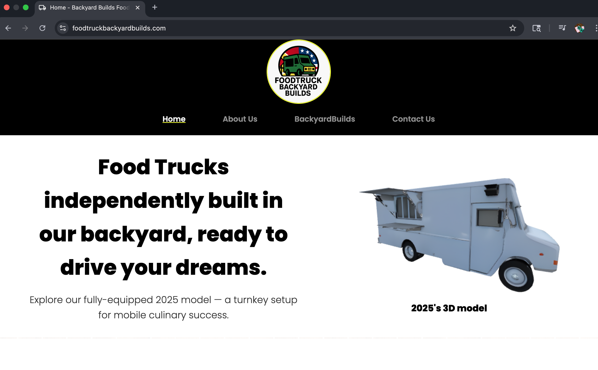

# Food Truck for Sale Website

A full-featured single-page site showcasing a custom-built food truck, with 3D interactive elements (Three.js), a working contact form (Node.js + Express + Nodemailer), and mobile-first responsive design.



## 🚚 Live Demo

👉 [Live Site Here](https://www.foodtruckbackyardbuilds.com)

## 🛠️ Technologies Used

- **Frontend**: Vite, HTML, CSS, JavaScript
- **3D**: Three.js, GLTF loader
- **Backend**: Node.js, Express, Nodemailer (SMTP via Gmail)
- **Hosting**: Netlify (frontend), Render (backend)

## ✉️ Contact Form

The contact form lets users send inquiries via email. It’s fully functional and uses a secure server to protect credentials.

## 📂 How to Run Locally

Clone both frontend and backend repos:

```bash
git clone https://github.com/cjmDevelop/Food-Truck-4-Sale-Website-using-Three.js
cd Food-Truck-4-Sale-Website-using-Three.js
npm install
cp .env.example .env   # Then fill in your Gmail info
npm run dev
